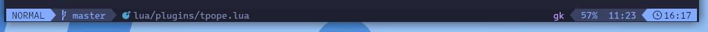
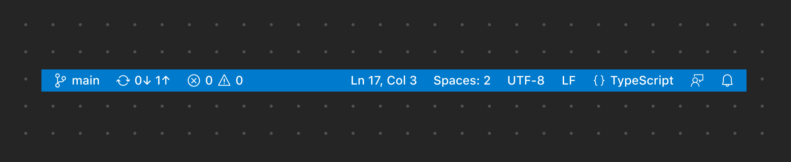
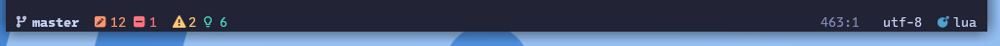
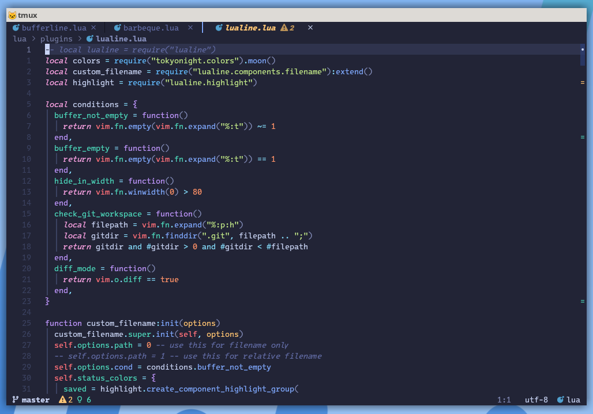

## Motivation

I'm using [folke's lazyvim](https://www.lazyvim.org/) and the default lualine setup looks like the following.



I want to have a statusline that is similar to that in VS Code.
It is simple, yet provide useful informations.



## Configuration options

The first step is to reset the options.

```lua
local colors = require("tokyonight.colors").moon()
local config = {
  options = {
    -- Disable sections and component separators
    component_separators = "",
    section_separators = "",
    theme = {
      normal = { c = { fg = colors.fg, bg = colors.bg } },
      inactive = { c = { fg = colors.fg, bg = colors.bg } },
    },
  },
  sections = {
    -- these are to remove the defaults
    lualine_a = {},
    lualine_b = {},
    lualine_y = {},
    lualine_z = {},
    -- These will be filled later
    lualine_c = {},
    lualine_x = {},
  },
  inactive_sections = {
    -- these are to remove the defaults
    lualine_a = {},
    lualine_b = {},
    lualine_y = {},
    lualine_z = {},
    lualine_c = {},
    lualine_x = {},
  },
}

```

Notice that my setup depends on the `tokyonight` colorscheme, but it can be adjusted accordingly.
The Idea is to setup a baseline options for lualine.

Next, we create a helper function to insert component to the left and right side of the statusline.

```lua
local function insert_left(component)
  table.insert(config.sections.lualine_c, component)
end

local function insert_right(component)
  table.insert(config.sections.lualine_x, component)
end
```

We can start using the function to add desired component accordingly.

Here's the components on the left side.

```lua
insert_left({
  "branch",
  icon = "",
  color = { fg = colors.fg, bg = colors.bg, gui = "bold" },
})

insert_left({
  "diff",
  symbols = { added = " ", modified = " ", removed = " " },
  diff_color = {
    added = { fg = colors.green },
    modified = { fg = colors.orange },
    removed = { fg = colors.red },
  },
  cond = conditions.hide_in_width,
})

insert_left({
  "diagnostics",
  sources = { "nvim_diagnostic" },
  symbols = { error = " ", warn = " ", info = " " },
  diagnostics_color = {
    color_error = { fg = colors.red },
    color_warn = { fg = colors.yellow },
    color_info = { fg = colors.cyan },
  },
})

insert_left({
  function()
    return "%="
  end,
})
```

And here's the components on the right side.

```lua
insert_right({
  "location",
  color = { fg = colors.fg_dark },
  cond = conditions.buffer_not_empty,
})

insert_right({
  "encoding",
})

insert_right({
  "filetype",
})
```

Easy enough.

And here's the result.



## Appendix

Most of neovim statusline setup displays the filename on the statusline.
I intentionally omit the filename because I personally think it is unnecessary.
But I do still want to know which file I'm currently working on.

The lazyvim's comes with a plugin called [bufferline.nvim](https://github.com/akinsho/bufferline.nvim) to display buffers along with its filename.

Additionally, I also use another plugin called [barbeque.nvim](https://github.com/utilyre/barbecue.nvim) to display _breadcrumb_, inspired by VS Code.

And here's the final result.



Find my full neovim configuration in [the repo](https://github.com/pirey/nvim).
