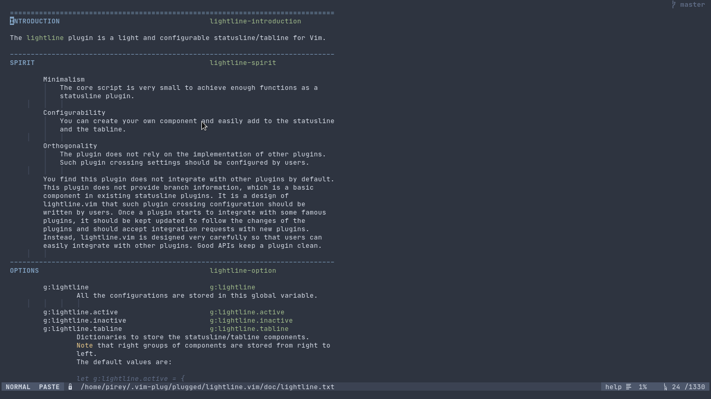
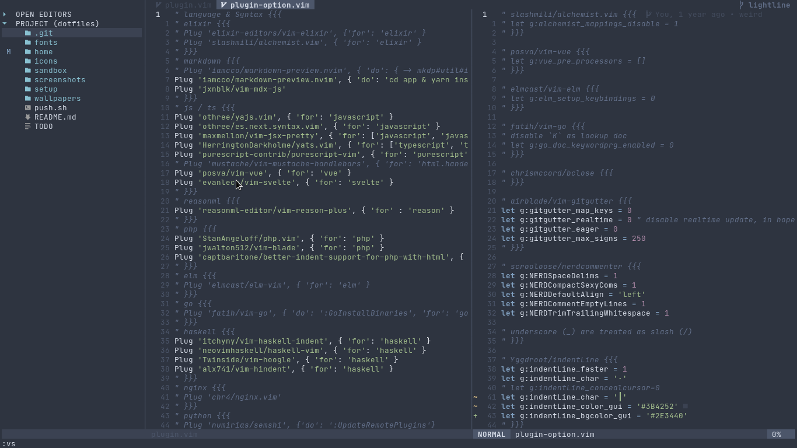
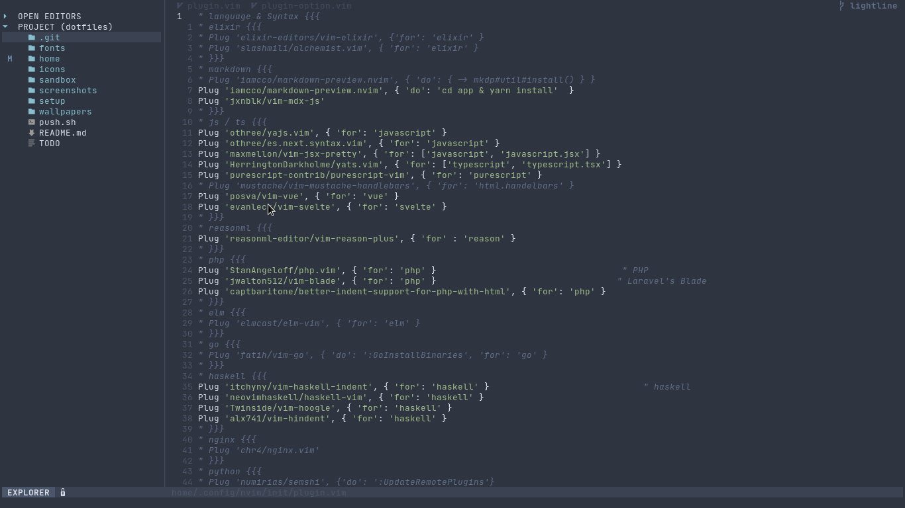

Here's a summary of how I customize vim lightline plugin to match my needs.

The idea is to have statusline that is nice, simple, and still useful.

So I come up with this setup.

## Full window, full feature



The left part only have two sections.

```vim
" left part
[[ 'mode', 'paste' ], [ 'readonly', 'filename', 'modified' ]]
```

While the right part is simpler with only one section.

```vim
" right part
[[ 'filetype', 'percent', 'lineinfo' ]]
```

I use [nord]() colorscheme, but doesn't really like the built-in nord theme for lightline, so I customize it to look more subtle.

```vim
let s:p.normal.left = [[ s:nord4, s:nord3, 'bold' ], [ s:nord4, s:nord1 ]]
let s:p.normal.middle = [[ s:nord4, s:nord1 ]]
let s:p.normal.right = [[ s:nord4, s:nord3 ]]
```

In the colorscheme file, I define colors extracted from the official nord color pallete, so I don't need to use the hex value directly.
Each variable is a list containing hex value and their respective value for term color, but I only use terminal with gui colors, so I use default values from built-int nord lightline theme.

```vim
let s:nord0 = ["#2E3440", "NONE"]
let s:nord1 = ["#3B4252", 0]
let s:nord2 = ["#434C5E", "NONE"]
let s:nord3 = ["#4C566A", 8]
let s:nord4 = ["#D8DEE9", "NONE"]
let s:nord5 = ["#E5E9F0", 7]
let s:nord6 = ["#ECEFF4", 15]
let s:nord7 = ["#8FBCBB", 14]
let s:nord8 = ["#88C0D0", 6]
let s:nord9 = ["#81A1C1", 4]
let s:nord10 = ["#5E81AC", 12]
let s:nord11 = ["#BF616A", 1]
let s:nord12 = ["#D08770", 11]
let s:nord13 = ["#EBCB8B", 3]
let s:nord14 = ["#A3BE8C", 2]
let s:nord15 = ["#B48EAD", 5]

" additional color for accent
let s:nord3_bright = ["#616E88", 8]
```

## Split window, simplified



I like the statusline to display full path (relative path) for current file, but when using split the space is limited, so I adjust the filename component to only show the filename. Moreover, I set the lineinfo and filetype component to "dissapear" on specific window width.

The way to do that is by using custom component and bind it to a function we define. For example, this is how I setup the lineinfo component.

```vim
let g:lightline.component_function = { 'lineinfo': 'LightlineLineinfo' }

function! LightlineLineinfo() abort
    if winwidth(0) < 86
        return ''
    endif

    let l:current_line = printf('%-3s', line('.'))
    let l:max_line = printf('%-3s', line('$'))
    let l:lineinfo = ' ' . l:current_line . '/' . l:max_line
    return l:lineinfo
endfunction
```

Also, if you notice, the inactive window only display filename with dimmed highlight, so I can focus on current window but can still see other files opened. I do that by setting the highlight of foreground for inactive window to match the background for each section.

```vim
let s:p.inactive.left =  [[ s:nord3, s:nord1 ], [ s:nord1, s:nord1 ]]
let s:p.inactive.middle = [[ s:nord1, s:nord1 ]]
let s:p.inactive.right = [[ s:nord1, s:nord1 ], [ s:nord1, s:nord1 ]]
```

## Narrow window, even more simplified



You can see that when the window is too small, I just hide other components except the `mode`, by using the same method as lineinfo above, but with different window width breakpoint.

Also, since I consider the explorer a special window, I give it special treatment by customizing the `mode` string. I can also specify another strings for additional plugins I want to customize later.

```vim
let g:lightline.component_function = { 'mode': 'LightlineMode' }

function! LightlineMode() abort
    let ftmap = {
                \ 'coc-explorer': 'EXPLORER',
                \ 'fugitive': 'FUGITIVE'
                \ }
    return get(ftmap, &filetype, lightline#mode())
endfunction
```

## Tabline / Bufferline

Since lightline doesn't handle the tabline the way I expected, [I use separate plugin for it](https://github.com/mengelbrecht/lightline-bufferline), and use the default setup they provide on the readme.

The only customization is of course the color highlighting.

```vim
let s:p.tabline.left = [[ s:nord2, s:nord0 ], [ s:nord4, s:nord1, 'bold' ]]
let s:p.tabline.middle = [[ s:nord0, s:nord0 ]]
let s:p.tabline.right = [[ s:nord3_bright, s:nord0, 'bold' ]]
let s:p.tabline.tabsel = [[ s:nord4, s:nord3, 'bold' ]]
```

Additionally, I use some tricks for the tabline which I will explain in another post.

## Credit

I grab most of the configuration from [bandithijo](https://github.com/bandithijo/nvimrc/blob/master/plugin/config/config-lightline.vim), and tweak it further according to my needs.

## P.S.

You can find full configuration on my [dotfiles](https://github.com/pirey/dotfiles).

- [lightline colorscheme](https://github.com/pirey/dotfiles/blob/master/home/.config/nvim/autoload/lightline/colorscheme/nord_subtle.vim)
- [lightline configuration](https://github.com/pirey/dotfiles/blob/master/home/.config/nvim/plugin-options/lightline.vim)
- [lightline-bufferline configuration](https://github.com/pirey/dotfiles/blob/master/home/.config/nvim/plugin-options/lightline-bufferline.vim)
