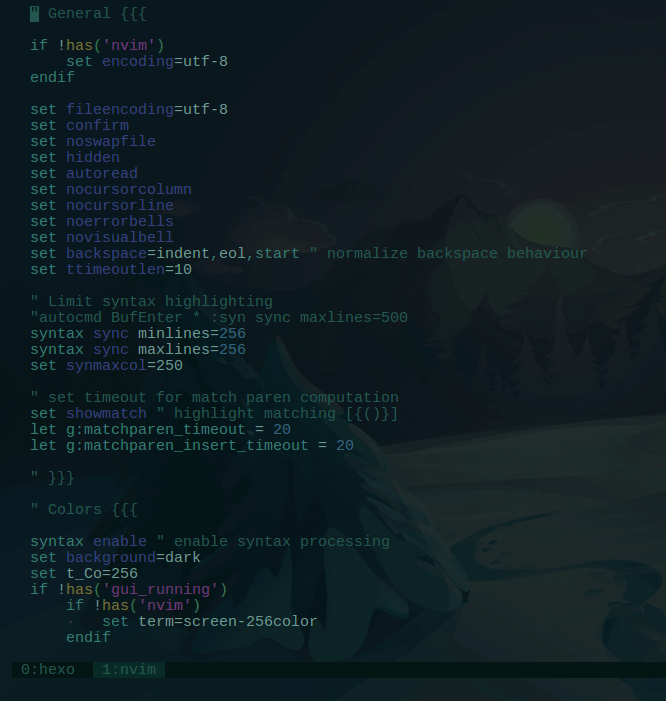
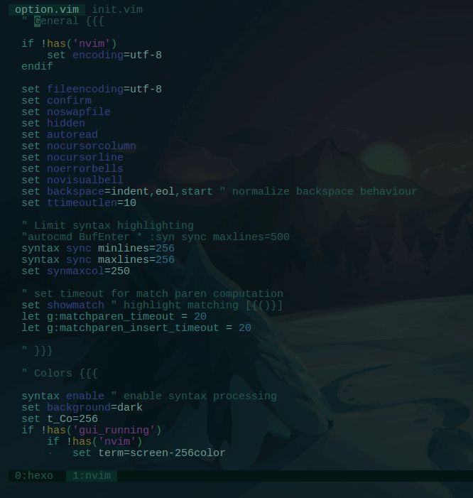

I have a [beautiful vim setup](https://github.com/pirey/dotfiles). It suited my needs very well, everything was perfect. Until someday it can't keep up with my typing speed.

No, I'm not saying that I'm the fastest typist in the world. What I mean by that is, my vim became really slow when I work on 1000 LOC or so.

So I tried to disable and enable some of my plugins to figure out what caused the issue. But, before I came to this point, I always suspicious with the syntax highlighting feature in vim. This is not the first time that I came across this slow syntax highlight issue.

Previously, I have done some research and found some workarounds.

For example, I used this snippet to limit the syntax highlighting to only specified column.

```vim
syntax sync minlines=256
syntax sync maxlines=256
set synmaxcol=250
```

I have also tried to minimize some other burden for vim, like disabling the `cursorline`, and disabling `matchparen` plugin.

Also I found someone mentioned that we can use `set regexpengine=1` to solve the issue, which is not, and my vim hangs when I opened a typescript project.

All the solution above doesn't give the kind of result I expected. Vim performance is still relatively the same.

My conclusion (for now) is that either vim is slow (the syntax highlight) or it is my laptop that is too slow.

Once I saw a [talk by some dude](https://www.youtube.com/watch?v=aHm36-na4-4) where he demonstrate some cool vim tricks and stuff. Then suddenly from [out of nowhere](https://youtu.be/aHm36-na4-4?t=620) he mentioned that he don't like syntax colouring. I was like, _whut?_ I mean, how can we write code and keep being sane without using syntax highlight? Furthermore, I even found [a compilation of articles](https://dev.to/huytd/turning-off-the-syntax-highlighter-8af) giving advice to disable syntax highlighting. I don't get it. And I still don't understand it untill now.

Looking at my issue right now, I think I will give it a spin and disable syntax highlight. But I the other side, I still rely on the syntax highlighting. Its just too helpful to be entirely thrown away.

So I came up the idea to create a custom function in vim to toggle syntax highlight. So I can keep using highlight when I'm editing simple file with relatively small content.

The function is something like this:

```vim
function! SynToggle()
    if exists('g:syntax_on')
        syntax off
    else
        syntax enable
    endif
endfunction
```

To make it easier for me to invoke the function, I created a command to call it:

```vim
command! SynToggle :call SynToggle()
```


But the problem is, I use custom highlight rules in my setup, and when I toggle the highlighting that way, my custom highlight broke.



That is because vim reset the highlight rules everytime we turned on / off the syntax highlight.

Luckily, I have my custom highlight setup separated on its own file, `highlight.vim`, so I can easily `source` it everytime I toggle the highlight. Like this:

```vim
function! SynToggle()
    if exists('g:syntax_on')
        syntax off
    else
        syntax enable
        source my_custom_highlight.vim
    endif
endfunction
```



Nice.
