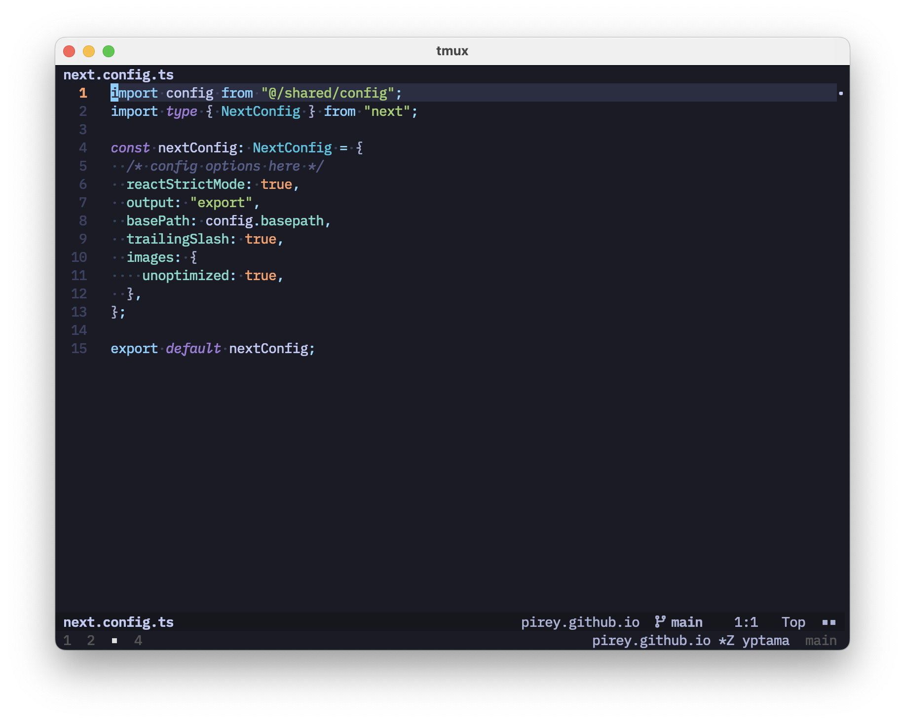

## Motivation

When we start tmux, by default it will show a status line at the bottom of the screen showing information of the current session.


Depending on our use case, it may or may not be enough. Some people, including myself, like to do some customizations, and I tend to make things simple.


It is nice and simple, I liked it. I don't like it when I open Neovim and the status line got stacked on top of it.



I found out that I can toggle the tmux status line on and off using the following command:

```bash
tmux set -g status
```

It was fine for me to toggle once in a while but then I thought, what if I just get rid of it? What could go wrong?

## Getting rid of the status line

It is simple enough to hide the tmux status line, we just need a little adjustment.

```tmux
# hide status line
set-option -g status off

# add keybinding for easy toggle
bind-key S set -g status
```

And ... poof!

After hiding the status line, however, I can think of at least two implications that may arise. One is I can no longer see tmux session information. Moreover, I could not tell if I'm currently inside a tmux session or not.

## Tmux navigation

Fortunately, tmux has built-in feature to interactively choose session, window or pane.
We can invoke the chooser by pressing `prefix+s` or `prefix+w`. It also has built-in preview of the active panes.
With this, I should not be too worried about session information visibility anymore, I can just navigate around.


## Tmux beacon

I just need something to tell me that I'm using tmux, one without taking up too much space.
The best thing I had in mind is to hook into at least two places: the shell prompt and neovim status line.
Ideally it would be nice to have it in other terminal programs as well but so far it is enough.
For the shell prompt, I'm using [starship](https://starship.rs/), and as for neovim status line, I'm using [lualine](https://github.com/nvim-lualine/lualine.nvim).

Here's the configuration for starship:

```toml
[custom.tmux]
description = "Indicator that shows up if currently in a tmux session"
command = """ echo '■' """
when = """ [[ -n $TMUX ]] && exit 0 """
```

And here's the configuration for lualine:

```lua
local tmux_char = {
  function()
    -- check if current pane is zoomed
    local result = io.popen("tmux list-panes -F '#F' | grep Z")

    if result ~= nil and result:read("*a") ~= "" then
      result:close()
      return "■■" --current pane is zoomed
    else
      return "■" -- not zoomed
    end
  end,
  padding = { left = 1, right = 1 }, -- We don't need space before this
  cond = function()
    return os.getenv("TMUX") ~= nil
  end,
  on_click = function()
    os.execute("tmux resize-pane -Z")
  end,
}

return {
  "nvim-lualine/lualine.nvim",
  opts = {
    -- other options...
    sections = {
      lualine_z = {
        tmux_char,
      },
    },
  },
}
```

With these two adjustments in place, I can easily tell if I'm currently inside a tmux session.

## Appendix

I have come to accept that in order to gain something, we need to give up something else in the process. In this case, I think it is worth the trade.
