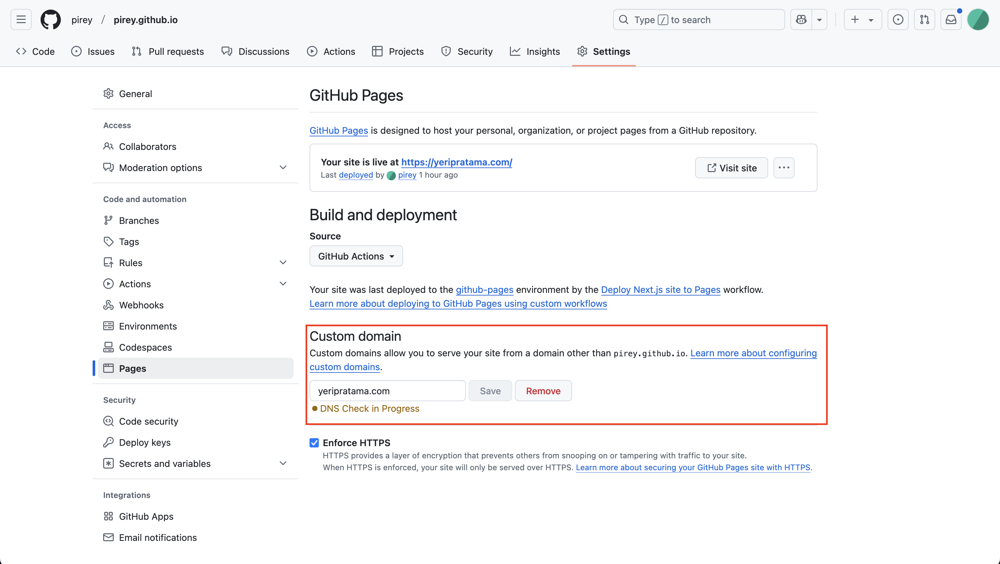

Earlier this morning, someone out of nowhere deployed some ridiculously shady website under my domain name.

And here's how it went.

## GitHub pages

[GitHub pages](https://pages.GitHub.com/) lets us deploy our repositories as websites for free, which then hosted under GitHub's URL `<username>.GitHub.io/<repository>` , in other word, it is [Vercel](https://vercel.com) but for old men with only static sites.

By default, the URL will include `repository` name as the pathname, but we can create a special repository with a particular name `<username>.GitHub.io` to deploy the website to the root path, let's just call it the _root repository_.

Moreover, we can also use custom domain name, which includes adding some records in the DNS configuration.

## Domain takeover issue

I was in the middle of revamping my old blog website to the new one, which I didn't plan if not because of the issue I encountered when running it locally due to broken dependency, which I was too lazy to fix.

Initially, I created a new repository to hold the new website to work on the new layout and some testing.

Before I proceed to merge the changes to the old blog repository, I had an idea to put other stuff besides blog posts in this new website, so I planned to use the _root repository_ so I can deploy it at the root path.

The _root repository_ has the old content as well, but since I don't need it anymore I proceed to nuke it out of existence with the delete button, planning to create a new one for the new website.

Little did I know, that repository was holding the only thing that tied my domain to my GitHub repository: the **Custom Domain** section in the repository configuration.

Right after that, before I had the chance to finish the setup for the new repository, I went away to check on my website and I was humiliated with what I saw.

Behold: a relatively ugly gambling website targeted for poor people with poor judgement!

I believe that was done using some automated bot or something similar, because it happened not long after I deleted my GitHub repository that has the custom domain configuration.

Naturally, I tried to regain control over my domain name by configuring custom domain in my repository, but GitHub has the audacity to display error message saying the domain has already been taken.

It was at this moment I realized that apparently my blog has been hosted without domain verification.

So I went to update my DNS configuration and finally I regain back my domain name.

## Securing custom domain

I will admit that part of this embarrassment is no doubt a mistake on my end.

They have indeed [warned](https://docs.GitHub.com/en/pages/configuring-a-custom-domain-for-your-GitHub-pages-site/managing-a-custom-domain-for-your-GitHub-pages-site#securing-your-custom-domain) the users to secure their domain.

I'm quite surprised because the process to _secure_ my domain is actually as simple as adding a `TXT` record in the DNS configuration.

I am by no means a security expert, but I don't understand why they even let users proceed to use the domain without ensuring domain ownership.

If they assumed the users are familiar with DNS configuration security, why didn't they just just skip the warning and enforce the domain ownership verification?

Or, if they assume otherwise, why didn't they enforce it anyway since the process is quick and easy! (I guess?)
