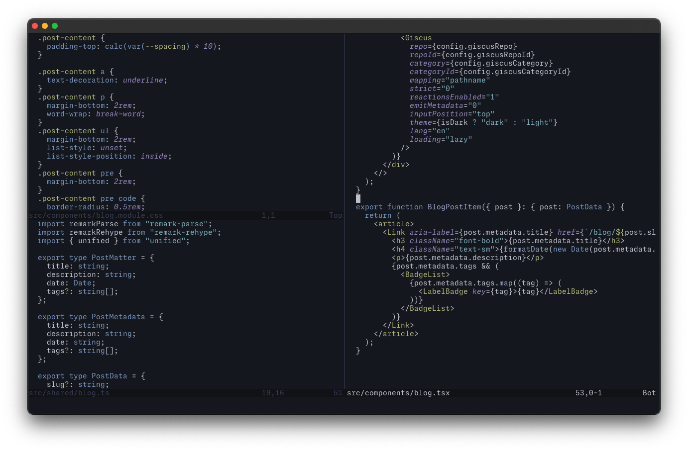
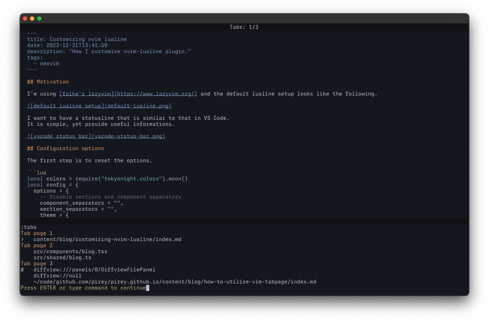

When we open a file in vim (or neovim, same thing in this case), it creates what it call a buffer. However, if we open multiple buffers, only one buffer is visible on the screen at a time.

<video
  src="./nvim-edit-multiple.mp4"
  controls
  width="100%"
  style="max-height: 500px;"
/>

To switch between open buffers, we can use `:b <buffer name>` command. We can press `<tab>` key and vim will do a completion.

We can organize the buffer and split them into windows to view the content of multiple files at the same time.



For most use case, we can just ignore vim's tabpage feature and proceed to just create a new split window or use one of the existing windows, or close a window when not needed. In fact, I rarely use vim tabpage myself for almost a decade and I was doing fine.

I found tabpage to be particularly helpful when I need to group multiple different files. I can surely switch between buffer and use splits, but having to manually switch them back and forth is not efficient. Even if the window layout is the same, e.g. two vertical split for tab one and tab two, it is much faster to switch between them than to switch each split separately.

<video
  src="./nvim-tab.mp4"
  controls
  width="100%"
  style="max-height: 500px;"
/>

We can use `:tabs` to list all open tabs and each grouped buffers.




Tabpage is also useful when we use a plugin that _require_ multiple windows. Here are some of the plugin that comes to mind:

- [diffview.nvim](https://github.com/sindrets/diffview.nvim)
- [nvim-dap-ui](https://github.com/rcarriga/nvim-dap-ui)
- [neogit](https://github.com/NeogitOrg/neogit)
- [dbui](https://github.com/kristijanhusak/vim-dadbod-ui)

## Appendix

By default, vim will display multiple tabpage in the tabline, however I don't like the way it looks and I prefer something simpler. Here's my custom tabline to only display one item labelled `Tabs 1/n`.

```lua
vim.opt.tabline = "%=Tabs: %{tabpagenr()}/%{tabpagenr('$')}%="
```

To switch between buffer opened in different tab and also switch to that tab automatically, we can set the following options.

```lua
vim.opt.switchbuf = { "uselast", "useopen", "usetab" }
```
