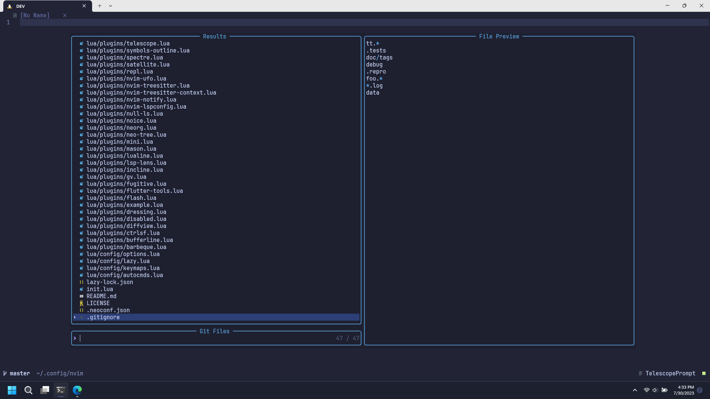
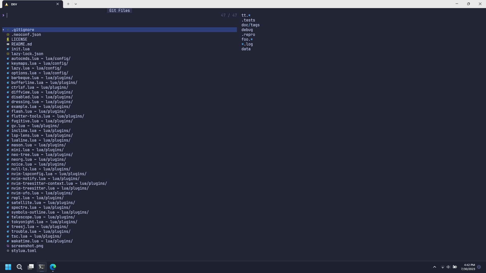
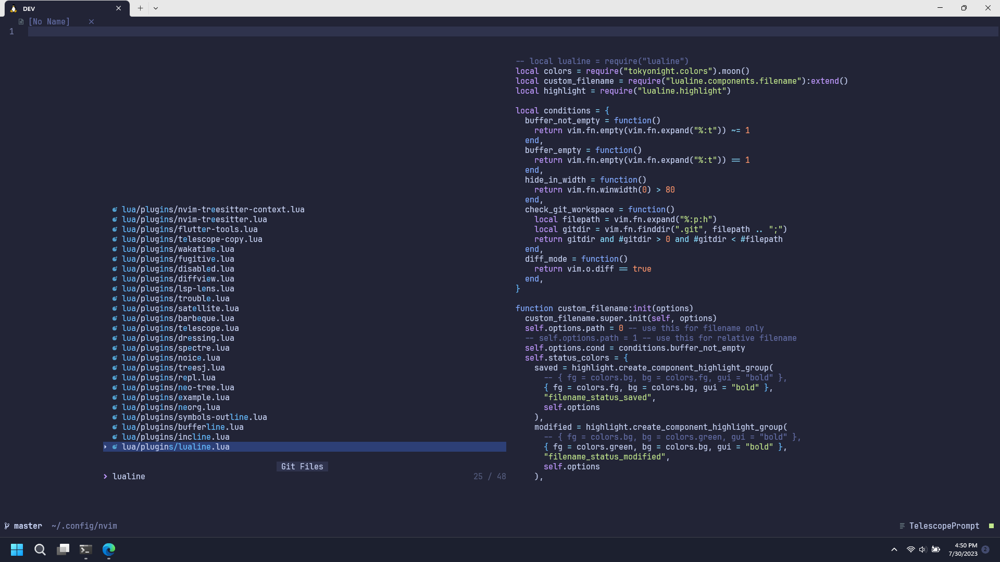
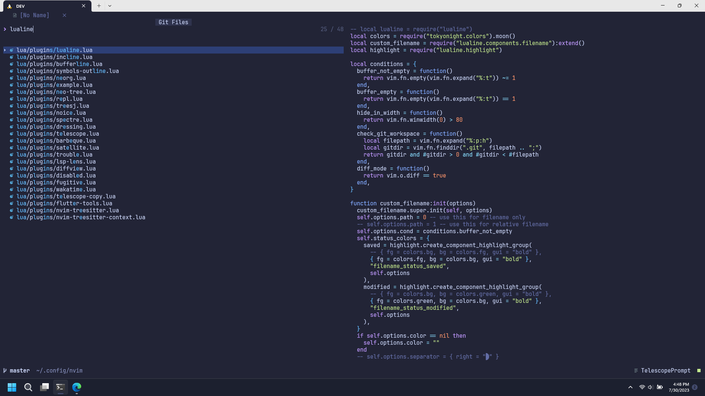
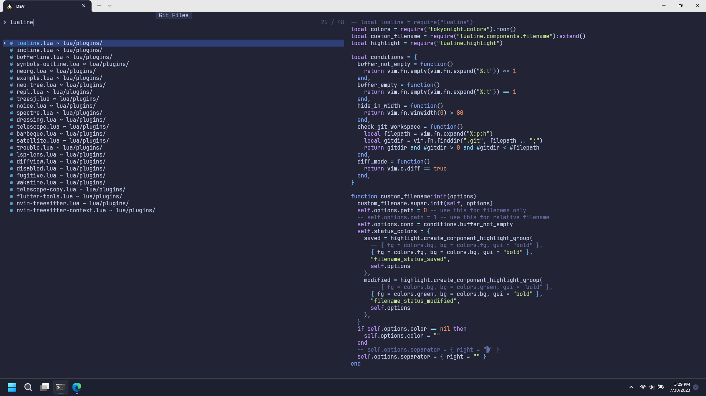

## Prerequisites

The customization relies on the following plugins.

- [lazy.nvim](https://github.com/folke/lazy.nvim) plugin manager, to define telescope setup options
- [tokyonight](https://github.com/folke/tokyonight.nvim) colorscheme, to define color highlight

## Motivation

I don't like the default layout configuration because I consider it _not clean_.



I really appreciate the preview feature even though I'm not rely heavily on it, but sometimes I can't see them clear enough.

As you can see, the preview width is narrower than the width of the result list.

I can adjust the preview width to be larger, but then I need to reduce the width of the result list, which will make it hard to look if I have files with long name. The worse thing than that is the layout will look weird.

Then why don't we leverage the full size of our screen?

So here's what I did.



## Remove border



Technically, I just changed the color highlight or the border to match the color of the background.

As I mention in the prerequisites section above, I'm using tokyonight theme, and it provides a configuration option to override the highlight of a highlight group.

```lua
local function highlight_telescope(hl, c)
  local prompt = c.bg
  hl.TelescopeNormal = {
    bg = c.bg,
    fg = c.fg,
  }
  hl.TelescopeBorder = {
    bg = c.bg,
    fg = c.bg,
  }
  hl.TelescopePromptNormal = {
    bg = prompt,
  }
  hl.TelescopePromptBorder = {
    bg = prompt,
    fg = prompt,
  }
  hl.TelescopePromptTitle = {
    bg = c.bg_highlight,
    fg = c.fg,
  }
  hl.TelescopePreviewTitle = {
    bg = c.bg,
    fg = c.bg,
  }
  hl.TelescopeResultsTitle = {
    bg = c.bg,
    fg = c.bg,
  }
  hl.NoiceCmdlinePopupBorder = {
    bg = c.bg,
    fg = c.bg,
  }
end

return {
  {
    "folke/tokyonight.nvim",
    opts = {
      on_highlights = function(hl, c)
        highlight_telescope(hl, c)
      end,
    },
  },
}

```

## Maximize width and height

The next step is to determine how to maximize the width and height.

The `width` and `height` option can be specified using percentage values (>= 0 and < 1) or fixed values (>= 1).

In other words, we can't specify the width to have 100% width (unless we calculate the screen width manually).

Luckily, telescope provides an easy way to make it happen, even though it's unclear at first glance.

Instead of specifying fixed or percentage values for the `width` and `height`, we can instead specify the padding, so we can just set the padding to 0.

See `:h telescope.resolve.resolve_width()`

```lua
return {
  {
    "nvim-telescope/telescope.nvim",
    opts = {
      defaults = {
        layout_strategy = "horizontal",
        layout_config = {
          horizontal = {
            prompt_position = "top",
            width = { padding = 0 },
            height = { padding = 0 },
            preview_width = 0.5,
          },
        },
        sorting_strategy = "ascending",
      },
    },
  },
}
```

<br/>



## Full screen

The maximized height does not take up the `statusline` and `tabline` space, so it still show up.

We can make it cleaner and make the telescope real full screen.

There's no option provided by telescope to do it, but we can always use vim's auto command.

The idea is to hide the `statusline` and `tabline` each time we open telescope.

```lua
 -- keeps track of current `tabline` and `statusline`, so we can restore it after closing telescope
local temp_showtabline
local temp_laststatus

function _G.global_telescope_find_pre()
  temp_showtabline = vim.o.showtabline
  temp_laststatus = vim.o.laststatus
  vim.o.showtabline = 0
  vim.o.laststatus = 0
end

function _G.global_telescope_leave_prompt()
  vim.o.laststatus = temp_laststatus
  vim.o.showtabline = temp_showtabline
end

vim.cmd([[
  augroup MyAutocmds
    autocmd!
    autocmd User TelescopeFindPre lua global_telescope_find_pre()
    autocmd FileType TelescopePrompt autocmd BufLeave <buffer> lua global_telescope_leave_prompt()
  augroup END
]])
```

<br/>


## Customize path display

> **Update**: telescope.nvim now support this option out of the box (with better highlighting) after this [commit](https://github.com/nvim-telescope/telescope.nvim/commit/a4432dfb9b0b960c4cbc8765a42dc4fe2e029e8f).
>
> Just need to enable it like so:

```lua
path_display = {
  "filename_first",
},
```

---

By default, telescope will display full or relative file name with its directory name.

It makes it hard to scan the file name that I want to open.

I want it to show the file name and its directory name separately.

```
filename.ext ~ path/to/parent/directory
```

Telescope provide an option to format the path display.

```lua
local function normalize_path(path)
  return path:gsub("\\", "/")
end

local function normalize_cwd()
  return normalize_path(vim.loop.cwd()) .. "/"
end

local function is_subdirectory(cwd, path)
  return string.lower(path:sub(1, #cwd)) == string.lower(cwd)
end

local function split_filepath(path)
  local normalized_path = normalize_path(path)
  local normalized_cwd = normalize_cwd()
  local filename = normalized_path:match("[^/]+$")

  if is_subdirectory(normalized_cwd, normalized_path) then
    local stripped_path = normalized_path:sub(#normalized_cwd + 1, -(#filename + 1))
    return stripped_path, filename
  else
    local stripped_path = normalized_path:sub(1, -(#filename + 1))
    return stripped_path, filename
  end
end

local function path_display(_, path)
  local stripped_path, filename = split_filepath(path)
  if filename == stripped_path or stripped_path == "" then
    return filename
  end
  return string.format("%s ~ %s", filename, stripped_path)
end

return {
  {
    "nvim-telescope/telescope.nvim",
    opts = {
      defaults = {
        --
        --
        -- specify the formatter here
        path_display = path_display,
      },
    },
  },
}
```

<br/>


