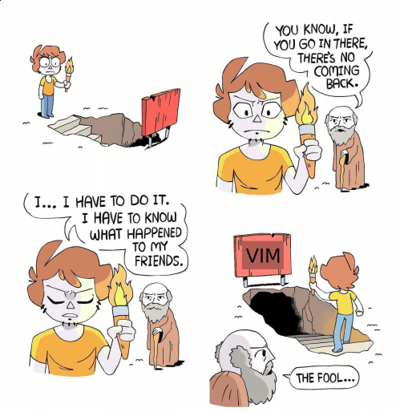

Don't use vim. Really. I'm not even joking. Once you go in, there's no coming back. I wish I don't know vim. I wish [all that time](https://github.com/pirey/dotfiles/commits/master) that I spend on tweaking it can be used on other stuff that matter.

## But . . . why?

If you heard a lot of cool stuff about vim, and want to try it, you better be ready to love it, or you're gonna get lost in it.

Forget about what have been told to you about vim. Forget it, or embrace it. Because those stories, either good or bad, are only one side of the coin.

Its like how [people in my place](https://www.google.com/maps/place/Indonesia/@-2.3200067,99.4329861,4z/data=!3m1!4b1!4m5!3m4!1s0x2c4c07d7496404b7:0xe37b4de71badf485!8m2!3d-0.789275!4d113.921327) tells story about how lovely it is, a life after marriage. They don't tell you that you have to be committed. Did they tell you that you have to sold your soul to master it? Well, neither did I. But regardless of whether its true or not, you still have to offer something as a tribute.

Vim is free (to use), but that doesn't mean it is cost free. Just like any other precious things in the world, if you want it, you have to put an effort to get it.

The truth is, vim may or may not suits you. Meanwhile, you still have many other things that you want to do. Humans are small creatures, with ridiculously huge expectation.

You can always use many other text editors or "IDE" that you're currently using. That's fine. Really. We have to get the jobs done in the end of the day.

That, or you can try using vim. It has many benefits. Its not really [good for your health, but its not bad for education](https://en.wikipedia.org/wiki/Akira_(1988_film\)).

## Anyway . . .
After all that, I use vim anyway. And I'm not joking. As I learn more about it along the way, I fell in love with it. I wish I don't know vim, but I glad I did, it really changed my life. I spend hell a lot of time tinkering with it, yet I always learn something new, I grow along with my knowledge.
