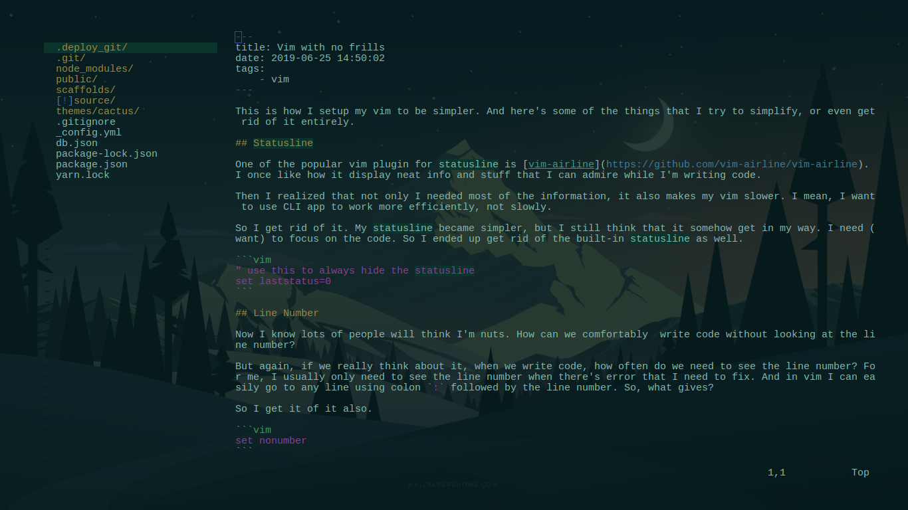
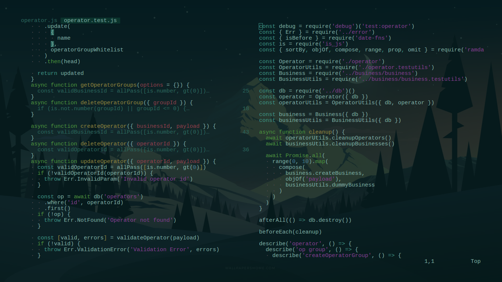

This is how I setup my vim to be simpler. And here's some of the things that I try to simplify, or even get rid of it entirely.

## Statusline

One of the popular vim plugin for statusline is [vim-airline](https://github.com/vim-airline/vim-airline). I once like how it display neat info and stuff that I can admire while I'm writing code.

Then I realized that not only I don't needed most of the information, it also makes my vim slower. I mean, I want to use CLI app to work more efficiently, not slowly.

So I get rid of it. My statusline became simpler, but I still think that it somehow get in my way. I need (want) to focus on the code. So I ended up get rid of the built-in statusline as well.

```vim
" use this to always hide the statusline
set laststatus=0
```

And from this, I realized that I don't really need many other UI fancyness when I'm writing code.

## Line Number

Now I know lots of people will think I'm nuts. How can we comfortably write code without looking at the line number?

But again, if we really think about it, when we write code, how often do we need to see the line number? For me, I usually only need to see the line number when there's error that I need to fix. And in vim I can easily go to any line using colon `:` followed by the line number. So, what gives?

So I get it of it also.

```vim
set nonumber
```

However, there's a little issue with this. Basically I need to add a little padding in the left side of the screen so that I can let my eyes breathe. Vim has something called `signcolumn`, to display little flag in beside line number. So I set it to always be displayed to act as padding.

```vim
set signcolumn=yes
```

## Vertical Split

For me, the way vim display vertical split separator between windowsis just not feels right. Its too bulky. I found a way to make it simple, that is just get rid of it.

```vim
" use single space as vertsplit separator

set fillchars+=vert:\ " here I put comment so that vim capture the space

```

This however, make it harder to differentiate content of horizontally split windows. But I mostly only use vertical split, and never really open more than two windows for a long period, so this is not a problem for me.

## Smuggle that squiggle

I always hate how vim display that funny squiggles in the beginning of every empty lines.

```
This is some content in a file.
Then comes tons of squiggles after this.
~
~
~
~
~
~
~
~
~
~
~
```

I mean, wth is even that? Let's get rid of it. Well, unfortunately there's no option to completely remove it, but we can workaround that, we software developer are good in doing it, aren't we?

Instead of removing it, because of course its not possible, we can change the highlight color for the squiggles `~`, by setting the highlight of `EndOfBuffer` highlight group.

```
hi EndOfBuffer ctermfg=0
```

Basically we change the foreground color to `0`, this usually matches with the color of the background, so we can somehow make it dissapear.

## Fold

Vim built-in fold highlight is plain ugly. But we can change it using `'foldtext'` option in vim. You can read more about it using `:h foldtext`.

```vim
function! NeatFoldText()
    let line = getline(v:foldstart)

    let nucolwidth = &fdc + &number * &numberwidth
    let windowwidth = winwidth(0) - nucolwidth - 3
    let foldedlinecount = v:foldend - v:foldstart

    " expand tabs into spaces
    let onetab = strpart('          ', 0, &tabstop)
    let line = substitute(line, '\t', onetab, 'g')

    let line = strpart(line, 0, windowwidth - 2 -len(foldedlinecount))
    let fillcharcount = windowwidth - len(line) - len(foldedlinecount)
    return line . '…' . repeat(" ",fillcharcount) . foldedlinecount . '…' . ' '
endfunction

set foldtext=NeatFoldText()
```

**NOTE:** I found the script to modify the foldtext on the internet, but I forget where did I found it. If you feel that you're the one made it, thank you! And let me know about it, I'll update this post with proper credit.

## Nerdtree

No, I'm not saying I'm getting rid of nerdtree. For this, I only get rid of the (▸) symbol for directory prefix. It also has a 'MinimalUI' option, so I use that.

```vim
let NERDTreeDirArrowExpandable = ' '
let NERDTreeDirArrowCollapsible = ' '
let NERDTreeMinimalUI = 1
```

## FZF

By default fzf comes with its own highlight colors, so I need to adjust it to match my setup.

```vim
let $FZF_DEFAULT_OPTS = '--color=16,fg:8,bg:-1,fg+:7,bg+:-1,gutter:-1,pointer:4,info:-1,border:-1,prompt:-1,header:-1'
```

## Screenshots





Nice.

**NOTE:** We can also use this nice plugin called [goyo](https://github.com/junegunn/goyo.vim) by [junegunn](https://github.com/junegunn) (the same author that writes fzf and some other nice stuff, go check him out) to achieve similar functionality as I mentioned above. It is a plugin that let you go into _zen_ mode in vim, without UI distractions. In fact, I was inspired by it, but unlike that plugin, I want to be in the zen mode all the time.
